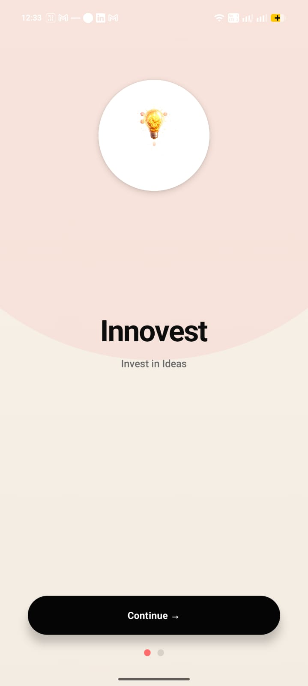
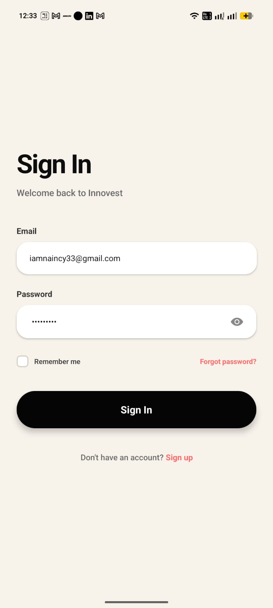
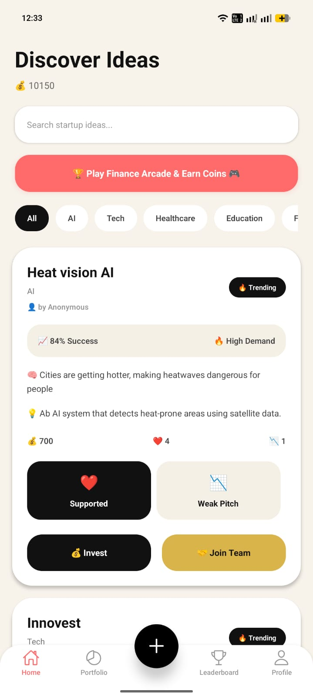
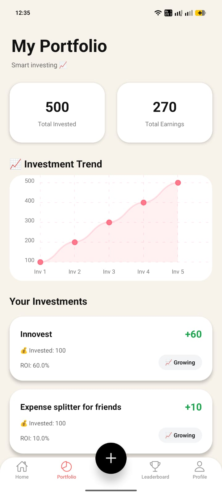
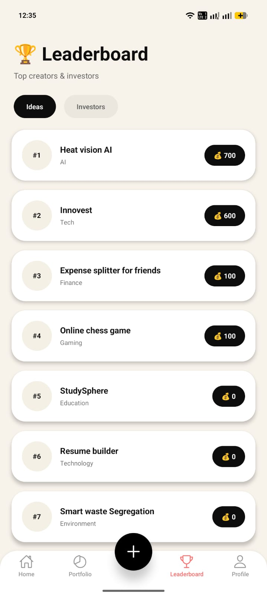
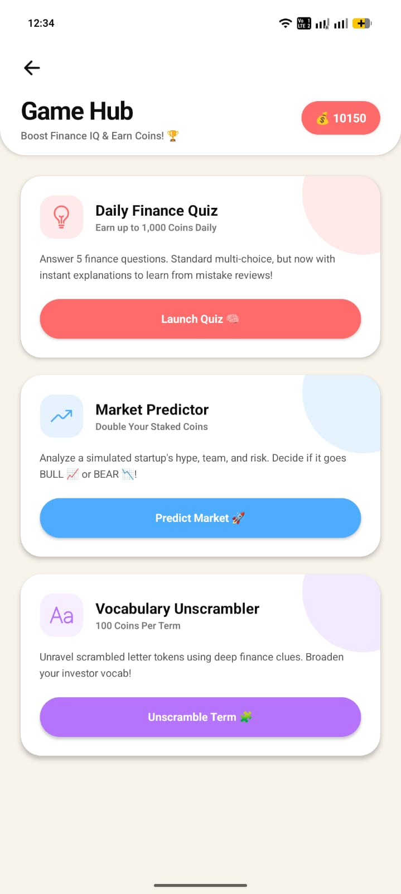
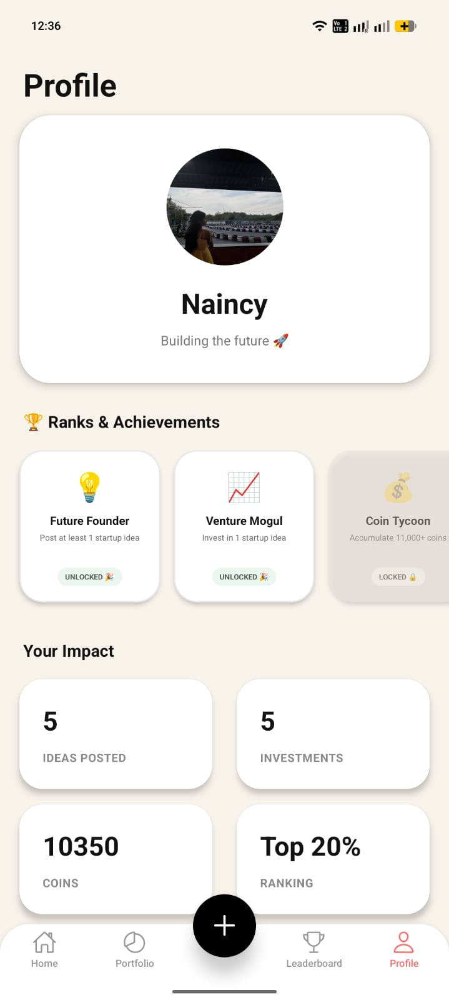

# 🚀 Innovest

<h3 align="center">
AI Powered Startup Idea Investment & Collaboration Platform
</h3>

<p align="center">
Share • Invest • Collaborate • Learn
</p>

<p align="center">


</p>

---

# 📖 About

Innovest is an AI-powered startup idea investment and collaboration platform built using **React Native** and **Firebase**.

Instead of investing real money, users receive **virtual coins** to invest in innovative startup ideas, analyze AI-generated market insights, collaborate with founders, improve financial literacy through interactive games, and monitor investment performance.

The platform combines **Entrepreneurship + Social Networking + Gamification + Investment Simulation** into one mobile application.

---

# ✨ Key Features

### 💡 Startup Idea Sharing

- Post startup ideas
- Category-wise ideas
- Problem & Solution description
- AI-powered market analysis

---

### 🤖 AI Market Analysis

Every startup idea receives:

- 📈 Success Rate
- 🔥 Market Demand
- ⚠ Risk Level

---

### 💰 Virtual Investment

- Invest virtual coins
- Support startup ideas
- Portfolio tracking
- ROI calculation

---

### 📊 Portfolio Analytics

- Investment History
- ROI
- Earnings
- Investment Trend Graph

---

### 🏆 Leaderboard

- Top Investors
- Coin Rankings
- Community Engagement

---

### 🎮 Finance Arcade

- Daily Finance Quiz
- Market Predictor
- Vocabulary Builder

Users earn virtual coins while improving financial knowledge.

---

### 🤝 Team Collaboration

- Join startup teams
- Send requests
- Accept/Reject requests

---

### 🔐 Authentication

- Firebase Authentication
- Secure Login
- Persistent Sessions

---

# 🛠 Tech Stack

## Frontend

- React Native
- Expo

## Backend

- Firebase Authentication
- Cloud Firestore
- Firebase Storage

## Libraries

- React Navigation
- React Native Chart Kit
- Expo Linear Gradient
- Expo Image Picker

---

# 📱 Application Screens

## Splash Screen



---

## Login



---

## Home / Discover Ideas



---

## Portfolio



---

## Leaderboard



---

## Finance Arcade



---

## Profile



---

# 📂 Project Structure

```
Innovest
│
├── assets
├── components
├── constants
├── hooks
├── navigation
├── screens
├── screenshots
├── utils
├── firebase.js
├── App.js
└── package.json
```

---

# ⚙ Installation

Clone Repository

```bash
git clone https://github.com/Naincy33/INNOVEST.git
```

Move into Project

```bash
cd INNOVEST
```

Install Packages

```bash
npm install
```

Run Project

```bash
npx expo start
```

---

# 🔥 Firebase Configuration

Enable:

- Firebase Authentication
- Cloud Firestore
- Firebase Storage

Create a firebase.js file with your Firebase configuration.

---

# 📊 Firestore Collections

```
users
ideas
comments
investments
teamRequests
notifications
```

---

# 🚀 Future Enhancements

- AI Recommendation Engine
- Push Notifications
- Real-time Chat
- Startup Mentorship
- Investor Dashboard
- Advanced Analytics
- Startup Funding Marketplace

---

# 🎯 Learning Outcomes

This project helped in understanding:

- Mobile Application Development
- React Native
- Firebase Integration
- Authentication
- Cloud Firestore
- State Management
- UI/UX Design
- Portfolio Analytics
- Gamification Concepts

---

# 👩‍💻 Developer

**Naincy**

B.Tech Computer Science Engineering

React Native Developer | AI Enthusiast | Full Stack Learner

GitHub

https://github.com/Naincy33

---

# ⭐ If you found this project useful

Please consider giving this repository a ⭐

It motivates me to build more projects.
